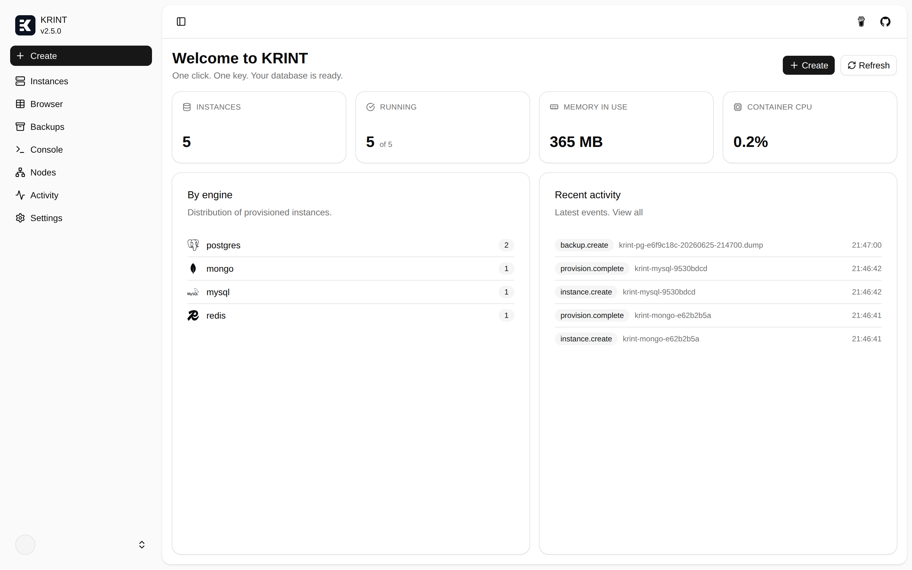
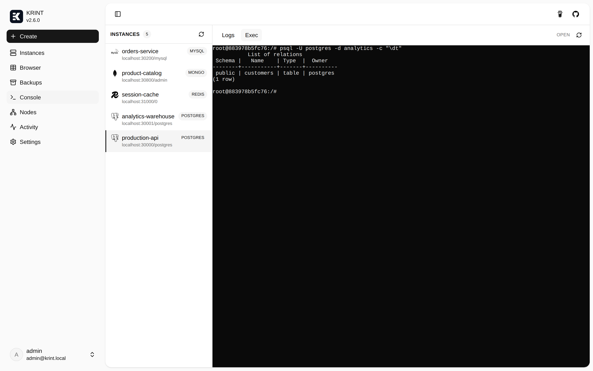
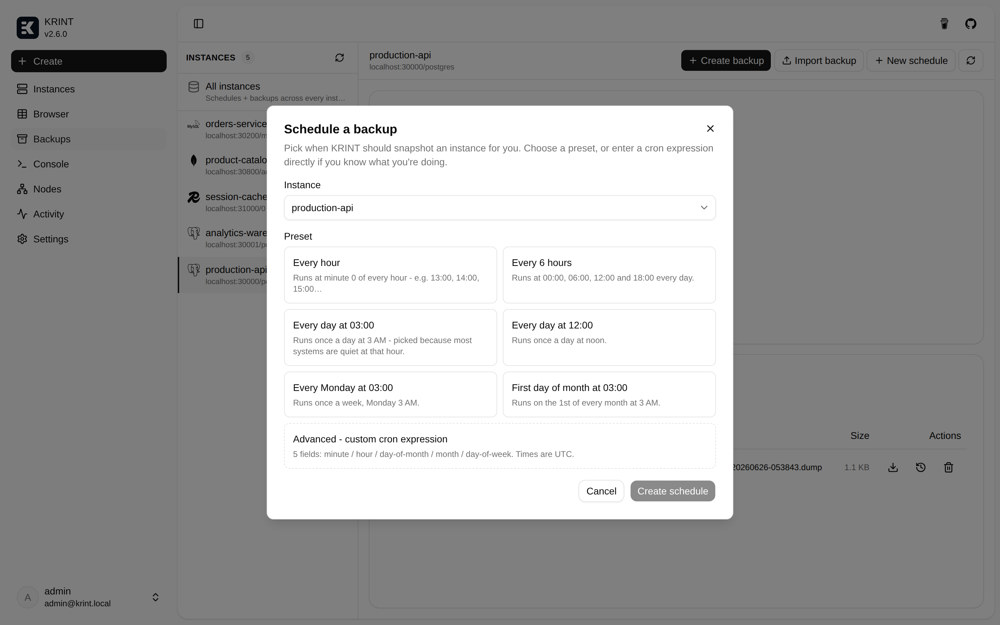
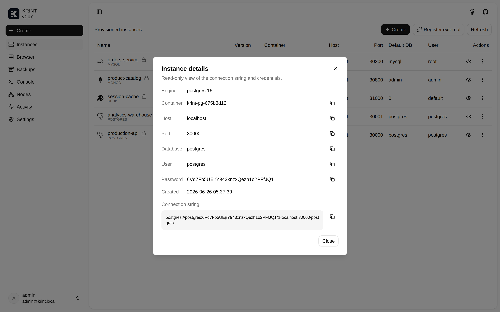
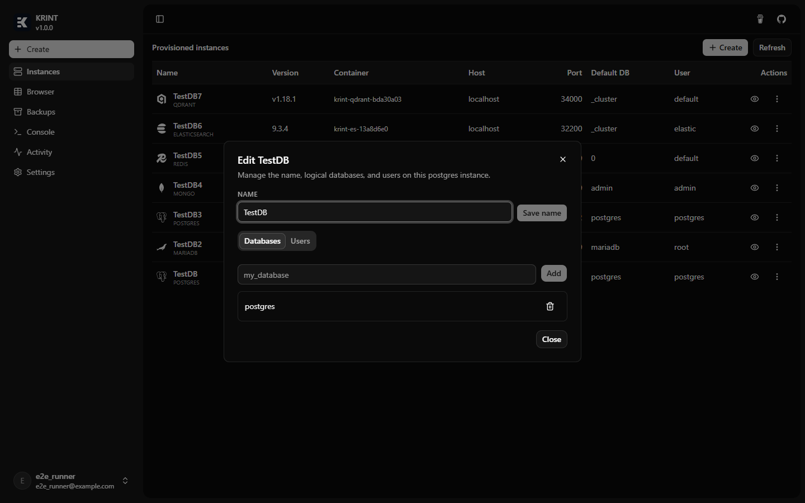
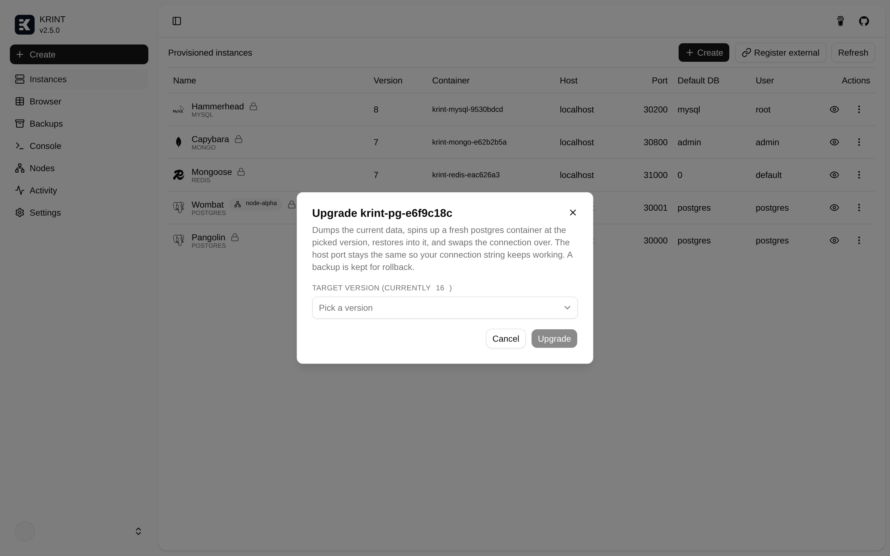
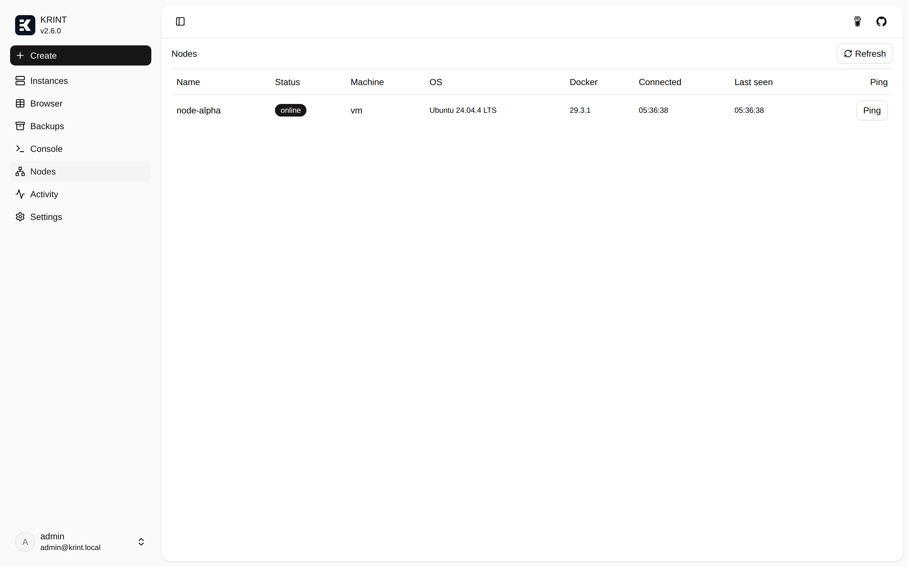
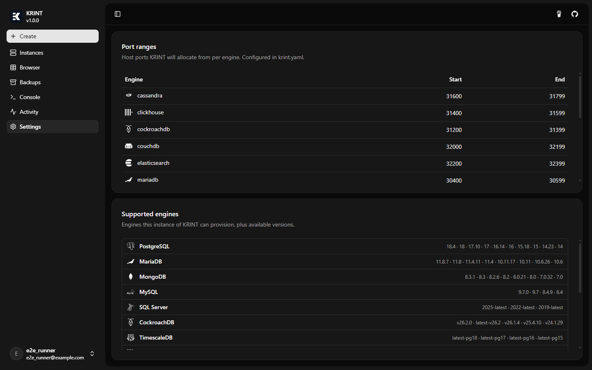

  

  <strong>KRINT</strong> 
  One click. One key. Your database is ready.

  
  
  
  

---

> **Heads up:** KRINT is in early development. Expect rough edges and breaking changes between versions.

## What is KRINT?

KRINT is a self-hosted database-provisioning platform. Pick an engine, click Launch, and you get a containerised instance with credentials, a host port, and a connection string in hand. Then browse rows, run queries, manage users, and schedule backups - all from one UI.

## Screenshots

  
  

  
  

<strong>Show more screenshots</strong>

  
  

  
  

  
  

  
  

  
  

  
  

## Features

- **16 engines** + opt-in plugins (pgvector, PostGIS, Redis Stack, APOC, and more).
- **Browse & query**: in-cell row editing and an ad-hoc SQL console.
- **Container console**: live log tailing and an interactive shell, in the browser.
- **Backups**: manual, scheduled, or upload your own; restore or upgrade in place.
- **Users & access**: logins, password resets, per-database grants.
- **OIDC auth**: bring your own provider or use the bundled Keycloak.
- **Nodes** (experimental): provision onto remote Docker hosts over one connection. See [docs/nodes.md](docs/nodes.md).

## Get started

- 📦 **[Self-hosting guide](https://docs.krint.pianonic.ch/self-host)** - run the image with `docker compose`.
- 🛠️ **[Developer setup](https://docs.krint.pianonic.ch/dev-setup)** - local dev with `dotnet run` + Bun, migrations, tests.

Full documentation: **[docs.krint.pianonic.ch](https://docs.krint.pianonic.ch)**

<strong>Tech stack</strong>

- **.NET 10** ASP.NET Core API (Mediator, EF Core, Clean Architecture).
- **Angular 21** + Signals + Spartan UI.
- **SignalR** for the live dashboard, log tailing, and interactive shell; **xterm.js** for the console.
- **Docker.DotNet** for container lifecycle.
- **Keycloak** for OIDC.
- **TUnit** + **Microsoft.Playwright** for tests; **OpenAPI** client via `bun run apigen`.

## License

TBD.

---

Made with care by <a href="https://github.com/PianoNic">PianoNic</a>

