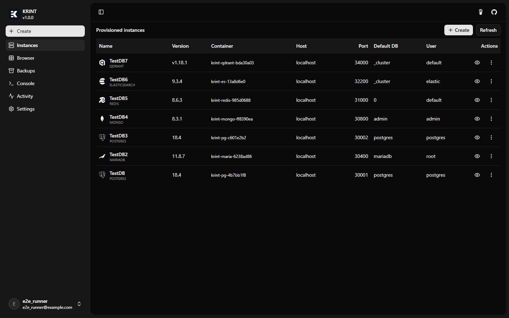
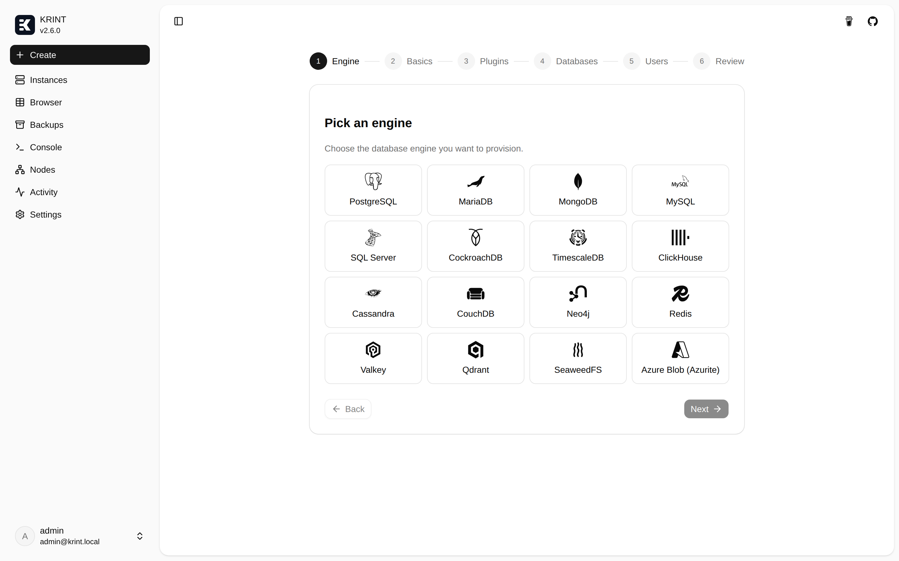
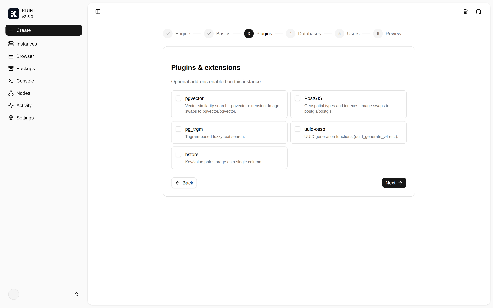
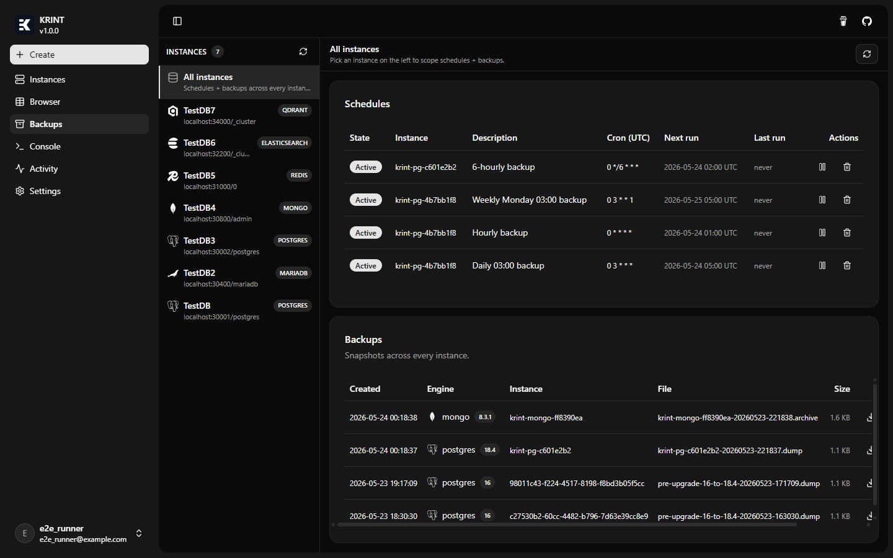
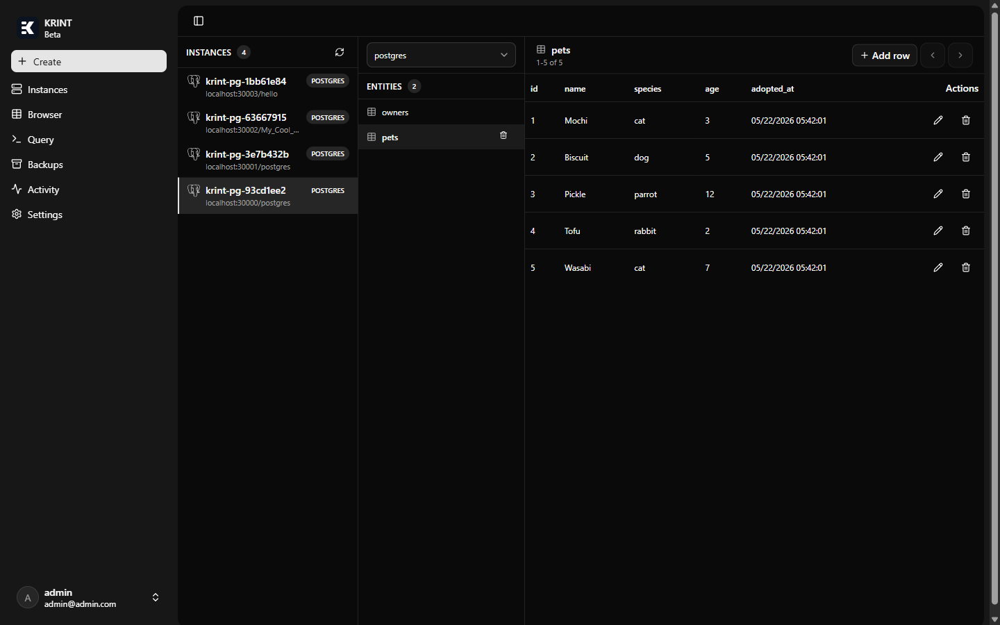
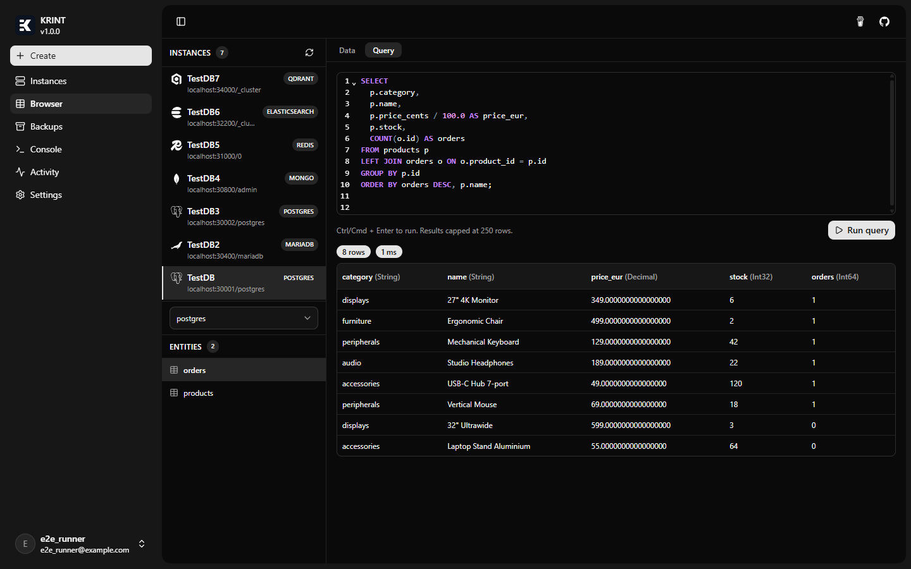
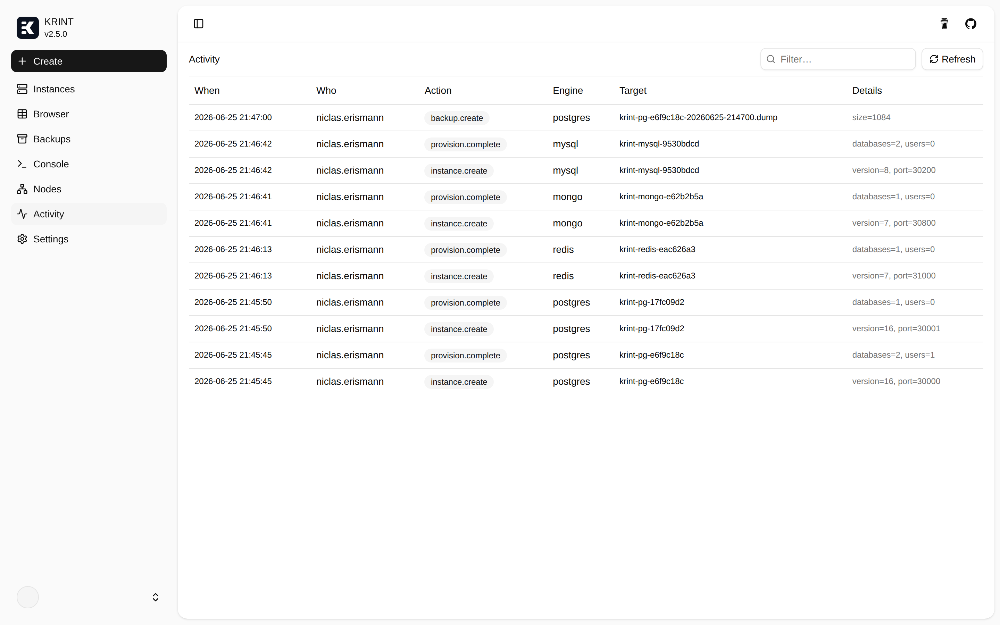

<p align="center">
  
</p>
<p align="center">
  <strong>KRINT</strong><br/>
  One click. One key. Your database is ready.
</p>
<p align="center">
  <a href="https://github.com/PianoNic/KRINT"></a>
  <a href="#getting-started"></a>
  <a href="#tech-stack"></a>
  <a href="#tech-stack"></a>
</p>

---

> **Heads up:** KRINT is in early development. Expect rough edges and breaking changes between versions.

## What is KRINT?

KRINT is a self-hosted database-provisioning platform. Pick an engine, click Launch, and KRINT spins up a containerised instance with credentials, a host port, and a connection string already in hand. Browse rows, manage users, schedule backups, install extensions - all from the SPA.

## Features

- **15 engines**: PostgreSQL, MariaDB, MongoDB, MySQL, SQL Server, CockroachDB, TimescaleDB, ClickHouse, Cassandra, CouchDB, Neo4j, Redis, Valkey, Elasticsearch, Qdrant.
- **Plugins**: pgvector, PostGIS, pg_trgm, Redis Stack, APOC, Graph Data Science, and more, opt-in at provision time.
- **Browse & query**: row/document browser plus an ad-hoc SQL console for the SQL engines (Ctrl/Cmd+Enter to run).
- **Backups**: manual or cron-scheduled; download or restore in place.
- **Users & access**: create logins, reset passwords, grant per-database access.
- **OIDC auth**: bring your own provider or use the bundled Keycloak.
- **Capability-aware UI**: engines without "users" or "rows" simply don't show those controls.

## Screenshots

<p align="center">
  
  
</p>
<p align="center">
  
  
</p>
<p align="center">
  
  
</p>
<p align="center">
  
</p>

## Tech stack

- **.NET 10** ASP.NET Core API (Mediator pattern, EF Core, Clean Architecture: API / Application / Domain / Infrastructure)
- **Angular 21** + Signals + Spartan UI (helm/brain) for the SPA
- **Docker.DotNet** drives container lifecycle (create, start, exec, tar-extract for restores)
- **Keycloak** for OIDC; Keycloakify for the bundled login theme
- **TUnit** + **Microsoft.Playwright** for end-to-end tests against a live stack
- **OpenAPI** at `/openapi/v1.json`; the Angular client is regenerated via `bun run apigen`

## Getting started

### Prerequisites

- Docker Desktop (with Docker daemon reachable on the default socket)
- .NET 10 SDK
- Bun (or Node) for the frontend
- Optional: Keycloak running on `http://localhost:8080` with the bundled `krint` realm

### Run the API

```powershell
dotnet run --project src/KRINT.API
```

Default URLs (see `src/KRINT.API/Properties/launchSettings.json`):

- HTTP: http://localhost:5165
- HTTPS: https://localhost:7064
- OpenAPI spec: `/openapi/v1.json`
- **Scalar API reference**: `/scalar/v1` - interactive docs you can call straight from the browser (Scalar replaces Swagger UI in this project)

### Run the frontend

```powershell
cd src/KRINT.Frontend
bun install
bun start          # ng serve on http://localhost:4200
bun run apigen     # regenerate the API client after backend changes
```

### Run in Docker

```powershell
docker build -t krint-api -f src/KRINT.API/Dockerfile src/KRINT.API
docker run --rm -p 8080:8080 -p 8081:8081 krint-api
```

The full stack (Keycloak + API + frontend) lives in [`docs/dev-setup.md`](docs/dev-setup.md).

## Testing

```powershell
dotnet run --project src/KRINT.Tests
```

`KRINT.Tests` uses [TUnit](https://github.com/thomhurst/TUnit). The suite includes both unit tests and a Playwright-driven browser E2E (`E2E/KrintEndToEndTests.cs`) that exercises the wizard, instance dialogs, backups, and activity log against a live Keycloak + API + frontend.

## License

TBD.

---

<p align="center">Made with care by <a href="https://github.com/PianoNic">PianoNic</a></p>
